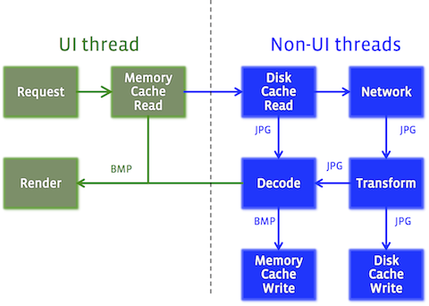

Image pipeline 负责完成加载图像，变成Android设备可呈现的形式所要做的每个事情。

大致流程如下:

1. 检查内存缓存，如有，返回
2. 后台线程开始后续工作
3. 检查是否在未解码内存缓存中。如有，解码，变换，返回，然后缓存到内存缓存中。
4. 检查是否在磁盘缓存中，如果有，变换，返回。缓存到未解码缓存和内存缓存中。
5. 从网络或者本地加载。加载完成后，解码，变换，返回。存到各个缓存中。

既然本身就是一个图片加载组件，那么一图胜千言。

上图中，`disk cache` 实际包含了未解码的内存缓存在内，统一在一起只是为了逻辑稍微清楚一些。关于缓存，更多细节可以参考[这里](caching.html)。

Image pipeline 可以从[本地](supported-uris.html)加载图片，也可以从网络。支持PNG，GIF，WebP, JPEG。
